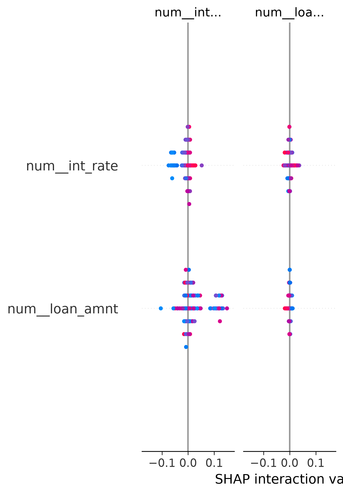
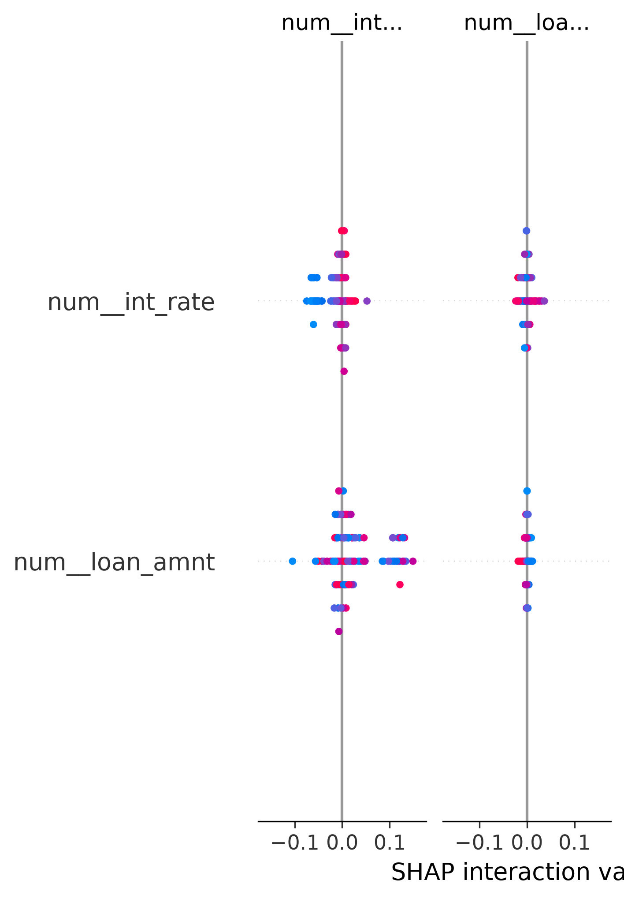
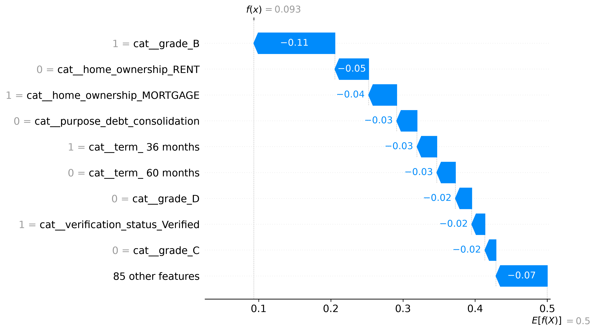

# 🏦 AI-Based Credit Risk Prediction System

<p align="center">
  
  
  
  
  
  
  
</p>

<p align="center">
An end-to-end <b>Machine Learning</b> web app that predicts <b>loan default probability</b> using a trained <b>Random Forest Classifier</b>, deployed with <b>Streamlit</b> and explained using <b>SHAP (Explainable AI)</b>.
</p>

---

## 📑 Table of Contents

[Description](#-project-description) • [Live Demo](#-live-demo) • [Features](#-features) • [Screenshots](#-project-screenshots) • [ML Workflow](#-machine-learning-workflow) • [Architecture](#️-project-architecture) • [Folder Structure](#-folder-structure) • [Dataset](#-dataset-information) • [Preprocessing](#-data-preprocessing) • [Feature Engineering](#️-feature-engineering) • [SMOTE](#️-handling-imbalanced-data-using-smote) • [Model Training](#-model-training) • [Hyperparameter Tuning](#️-hyperparameter-tuning-using-randomizedsearchcv) • [Evaluation](#-model-evaluation) • [SHAP](#-explainable-ai-using-shap) • [SHAP Results](#-shap-results) • [Feature Importance](#-feature-importance) • [Performance Results](#-model-performance-results) • [Tech Stack](#-technologies-used) • [Installation](#️-installation) • [Run Locally](#-run-locally) • [Requirements](#-requirements) • [Future Work](#-future-improvements) • [Author](#-author) • [License](#-license) • [Acknowledgements](#-acknowledgements)

---

## 📖 Project Description

This project predicts whether a loan applicant is **likely to default**, based on financial and credit history data. Instead of acting as a black box, it uses **SHAP (SHapley Additive exPlanations)** to explain *why* the model made each decision — showing exactly which factors increased or decreased an applicant's risk.

The project covers the full ML lifecycle — data understanding, EDA, preprocessing, feature engineering, class-imbalance handling, model training, hyperparameter tuning, evaluation, explainability — deployed as a multi-page **Streamlit** dashboard.

---

## 🌐 Live Demo

🚀 **[Try the application here](https://credit-risk-modeling-zjcg9jpcnu2dcddb8ims3c.streamlit.app/)**

📂 **[GitHub Repository](https://github.com/AnkitMaurya0/Credit-Risk-Modeling)**

---

## ✨ Features

- 🏦 Real-time loan default prediction
- 📈 Loan approval probability estimation
- 🎯 Random Forest Classifier trained on LendingClub data
- 🔍 SHAP explainability for individual predictions
- 📊 Interactive Plotly gauges and charts
- 📉 Dedicated Model Performance dashboard
- 📋 Global feature importance analysis
- 🌙 Professional dark-themed, multi-page UI
- 🧾 Downloadable prediction reports

---

## 📸 Project Screenshots

**🏠 Home Dashboard**


**📝 Loan Prediction**


**📊 Model Performance**


**🔍 Feature Importance & SHAP**


**ℹ️ About Project**


---

## 🤖 Machine Learning Workflow

```text
Loan Dataset
      │
      ▼
EDA
      │
      ▼
Preprocessing
      │
      ▼
Missing Value Handling
      │
      ▼
Encoding
      │
      ▼
SMOTE
      │
      ▼
Random Forest
      │
      ▼
Prediction
      │
      ▼
SHAP Explainability
      │
      ▼
Streamlit Dashboard
```

---

## 🏗️ Project Architecture

<details>
<summary><b>Click to expand</b></summary>

```text
Raw Data ─▶ Preprocessing (preprocessor.pkl) ─▶ SMOTE ─▶ Random Forest (best_model.pkl)
                                                              │
                        ┌─────────────────────────────────────┼─────────────────────────┐
                        ▼                                     ▼                         ▼
              predict()/predict_proba()             SHAP TreeExplainer         feature_importances_
                        └─────────────────────────────────────┴─────────────────────────┘
                                                    ▼
                                     Streamlit Multi-Page Dashboard
```

</details>

Each page (Prediction, Model Performance, Feature Importance, About) is self-contained but shares the same cached model and preprocessor, loaded once via `joblib`.

---

## 📂 Folder Structure

<details>
<summary><b>Click to expand</b></summary>

```text
Credit-Risk-Modeling/
├── app.py, requirements.txt, README.md
├── assets/style.css
├── pages/            1_Prediction.py, 2_Model_Performance.py, 3_Feature_Importance.py, 4_About.py
├── models/           best_model.pkl, preprocessor.pkl
├── notebook/         01_Data_Understanding → 06_SHAP_Analysis (.ipynb)
├── data/
│     ├── raw/loan.csv
│     └── processed/  feature_importance.csv, model_results.csv
├── results/shap/      shap_summary.png, shap_bar.png, shap_waterfall.png, shap_values.pkl
└── screenshots/       home.png, prediction.png, performance.png, feature_importance.png, about.png
```

</details>

---

## 📊 Dataset Information

**Dataset:** LendingClub Loan Dataset

| Feature | Description |
|---|---|
| `loan_amnt` | Loan amount requested |
| `term` | Repayment tenure (36 / 60 months) |
| `int_rate` | Interest rate on the loan |
| `installment` | Monthly EMI |
| `grade` / `sub_grade` | LendingClub credit grade |
| `emp_length` | Employment length |
| `home_ownership` | RENT / OWN / MORTGAGE |
| `annual_inc` | Annual income |
| `verification_status` | Income verification status |
| `purpose` | Purpose of the loan |
| `dti` | Debt-to-Income ratio |
| `delinq_2yrs` | Delinquencies in the last 2 years |
| `inq_last_6mths` | Credit inquiries, last 6 months |
| `open_acc` / `total_acc` | Open / total credit accounts |
| `pub_rec` / `pub_rec_bankruptcies` | Public records / bankruptcies |
| `revol_bal` / `revol_util` | Revolving balance / utilization |
| `mort_acc` | Mortgage accounts |
| `application_type` | Individual or joint |
| `loan_status` | **Target** — fully paid or charged off |

---

## 🧹 Data Preprocessing

- Removal of duplicate/irrelevant columns and missing-value imputation
- One-Hot Encoding for categorical variables and scaling for numerical ones
- Train/test split performed **before** resampling, to avoid data leakage

All transformations are encapsulated inside `preprocessor.pkl`, ensuring identical processing at training and inference time.

---

## 🛠️ Feature Engineering

- 🔢 **Credit Score → Grade Mapping** — converts a familiar 300–900 score into LendingClub's `grade`/`sub_grade`
- 💰 **EMI Calculation** — reducing-balance formula from loan amount, rate, and tenure
- 📐 **Debt Ratio & Utilization Buckets** — support human-readable, rule-based explanations alongside SHAP
- 🧾 Encoded categorical groups for purpose, home ownership, and verification status

---

## ⚖️ Handling Imbalanced Data using SMOTE

Loan datasets are naturally imbalanced — most applicants repay, few default. Training directly on this imbalance biases the model toward predicting "no default."

**SMOTE (Synthetic Minority Oversampling Technique)** is applied to the **training set only**, generating synthetic minority-class samples by interpolating between existing ones — balancing the classes without simple duplication, and helping the Random Forest learn a meaningful decision boundary for both classes.

---

## 🌲 Model Training

A **Random Forest Classifier** was chosen for its strong tabular-data performance, resistance to overfitting, and compatibility with fast, exact SHAP explanations via `TreeExplainer`.

**Workflow:** load SMOTE-balanced training data → fit `RandomForestClassifier` → validate on an untouched test set → save the best configuration as `best_model.pkl`.

---

## 🎛️ Hyperparameter Tuning using RandomizedSearchCV

`RandomizedSearchCV` efficiently searches across a wide hyperparameter space:

| Hyperparameter | Purpose |
|---|---|
| `n_estimators` | Number of trees |
| `max_depth` | Maximum tree depth |
| `min_samples_split` | Minimum samples to split a node |
| `min_samples_leaf` | Minimum samples at a leaf |
| `max_features` | Features considered per split |
| `class_weight` | Additional class balancing |

`RandomizedSearchCV` was preferred over exhaustive `GridSearchCV` since it samples a fixed number of combinations — much faster while still reliably finding strong configurations.

---

## 📈 Model Evaluation

The final model was evaluated on a held-out test set:

| Metric | What It Measures |
|---|---|
| **Accuracy** | Overall proportion of correct predictions |
| **Precision** | Of predicted defaulters, how many actually defaulted |
| **Recall** | Of actual defaulters, how many were correctly caught |
| **F1 Score** | Balance between Precision and Recall |
| **ROC-AUC** | Ability to distinguish defaulters from non-defaulters |

📌 **Recall** and **ROC-AUC** were prioritized — in credit risk, missing an actual defaulter is typically costlier than flagging a safe applicant for review. Exact values are in [`data/processed/model_results.csv`](data/processed/model_results.csv) and on the Model Performance page.

---

## 🔍 Explainable AI using SHAP

This project uses **`shap.TreeExplainer`**, optimized for tree-based models, to compute a **SHAP value per feature** for any applicant — showing exactly how much each feature pushed the predicted default probability up or down relative to the average prediction. Every prediction in the app comes with this transparent, mathematically grounded explanation.

---

## 📊 SHAP Results

**🌐 SHAP Summary Plot**


Shows the impact of every feature across many applicants at once — each dot is one applicant, its x-position shows whether that feature pushed the prediction toward default (right) or not (left), and its color shows whether the feature's value was high or low.

**📶 SHAP Feature Importance (Bar Plot)**


Ranks features by their average absolute SHAP value — the overall global impact of each feature on predictions, derived from actual SHAP values (distinct from the model's built-in `feature_importances_` below).

**🌊 SHAP Waterfall Plot**


Explains a **single applicant's** prediction — starting from the model's average prediction, it shows step-by-step how each feature pushed the result up or down to reach that applicant's final probability. This is the chart shown live for every prediction made in the app.

**How SHAP Explains Random Forest Predictions:** `TreeExplainer` uses the internal tree structure to compute exact Shapley values (rather than approximating them), tracing how splits on each feature affect the outcome across all trees, then averaging these into a fair, additive attribution per feature.

**📈 Typically increase risk:** high interest rate, high loan-to-income ratio, high DTI, high revolving utilization, lower credit grade, prior delinquencies/bankruptcies.
**📉 Typically reduce risk:** high verified income, strong credit grade (A/B), low DTI, low utilization, stable employment, no delinquency/bankruptcy history.
*(Exact rankings for this trained model: plots above and `results/shap/shap_values.pkl`.)*

---

## 🌟 Feature Importance


The Random Forest's built-in **`feature_importances_`** shows a **global, training-time** view of which features the model relied on most, based on impurity reduction across all trees.

> ⚠️ **Distinction:** `feature_importances_` reflects what the model learned *during training*; SHAP explains *individual predictions at inference time*. Both are shown in the app, clearly labeled. Full ranking: [`data/processed/feature_importance.csv`](data/processed/feature_importance.csv).

---

## 🏆 Model Performance Results


The Model Performance page visualizes the confusion matrix, ROC curve/AUC, precision-recall trade-off, and full metric breakdown — computed from the held-out test set and loaded live from `data/processed/model_results.csv`.

---

## 💻 Technologies Used

| Technology | Purpose |
|---|---|
| **Python** | Core programming language |
| **Streamlit** | Interactive web dashboard |
| **Pandas / NumPy** | Data handling & numerical computing |
| **Scikit-Learn** | Model training, evaluation, preprocessing |
| **Imbalanced-Learn** | SMOTE-based class balancing |
| **SHAP** | Explainable AI / interpretability |
| **Plotly** | Interactive charts and gauges |
| **Matplotlib** | Static SHAP visualizations |
| **Joblib** | Model & preprocessor serialization |

---

## ⚙️ Installation

```bash
git clone https://github.com/AnkitMaurya0/Credit-Risk-Modeling.git
cd Credit-Risk-Modeling
python -m venv venv
source venv/bin/activate      # macOS/Linux
venv\Scripts\activate         # Windows
pip install -r requirements.txt
```

---

## ▶️ Run Locally

```bash
streamlit run app.py
```

The app opens automatically at `http://localhost:8501`.

---

## 📦 Requirements

See [`requirements.txt`](requirements.txt) — core packages include:

```text
streamlit
pandas
numpy
scikit-learn
imbalanced-learn
shap
plotly
matplotlib
joblib
```

---

## 📌 Future Improvements

- 🚀 XGBoost / LightGBM model comparison
- 🔐 User authentication and role-based access
- 🗄️ Database integration for prediction history
- 🧾 Automated PDF report generation
- 🌐 Real credit bureau API integration
- 🤝 Loan recommendation system
- ☁️ Cloud database support

---

## 👨‍💻 Author

**Ankit Maurya**
B.Tech — Artificial Intelligence & Machine Learning

[](https://github.com/AnkitMaurya0)

---

## 📄 License

Licensed under the **MIT License** — free to use, modify, and distribute with attribution. See the `LICENSE` file for details.

---

## 🙏 Acknowledgements

- [LendingClub](https://www.lendingclub.com/) for the public loan dataset
- [SHAP](https://github.com/shap/shap) for accessible tree-model explainability
- [Streamlit](https://streamlit.io/) for fast ML dashboard development
- The open-source Python & Scikit-Learn community

---

<p align="center">⭐ If you found this project useful, please consider giving it a <b>Star</b> on GitHub!</p>

---

## ⚠️ Disclaimer

This project is for **educational and research purposes only**. Predictions are a decision-support tool and should **not** be treated as a final loan approval decision — actual approval depends on lender policies, verification, and regulatory requirements.
