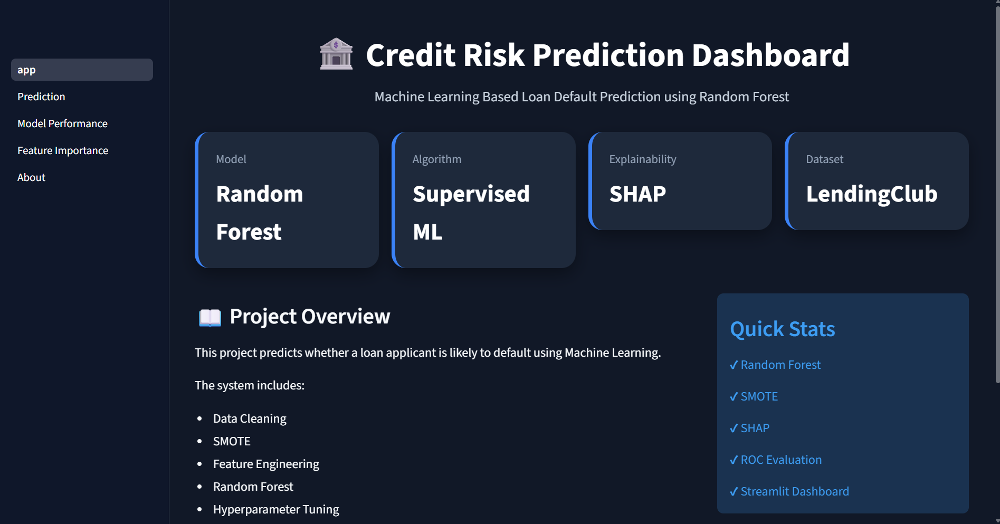
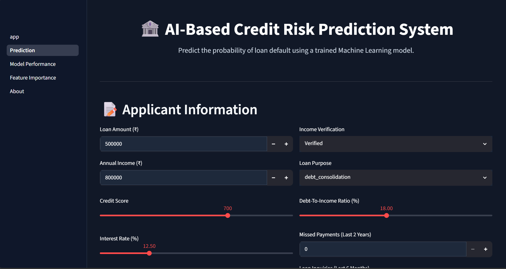
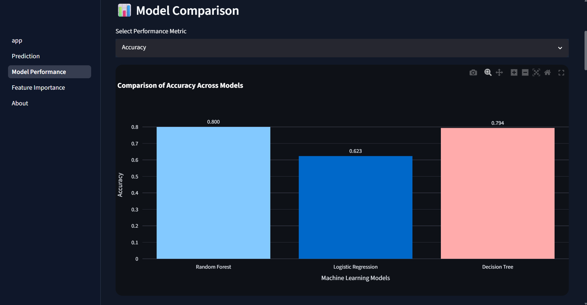
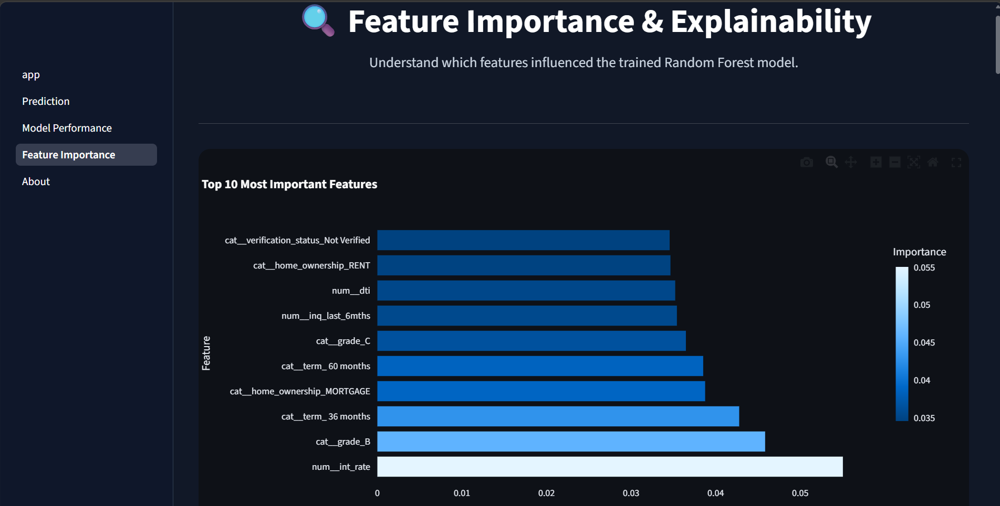
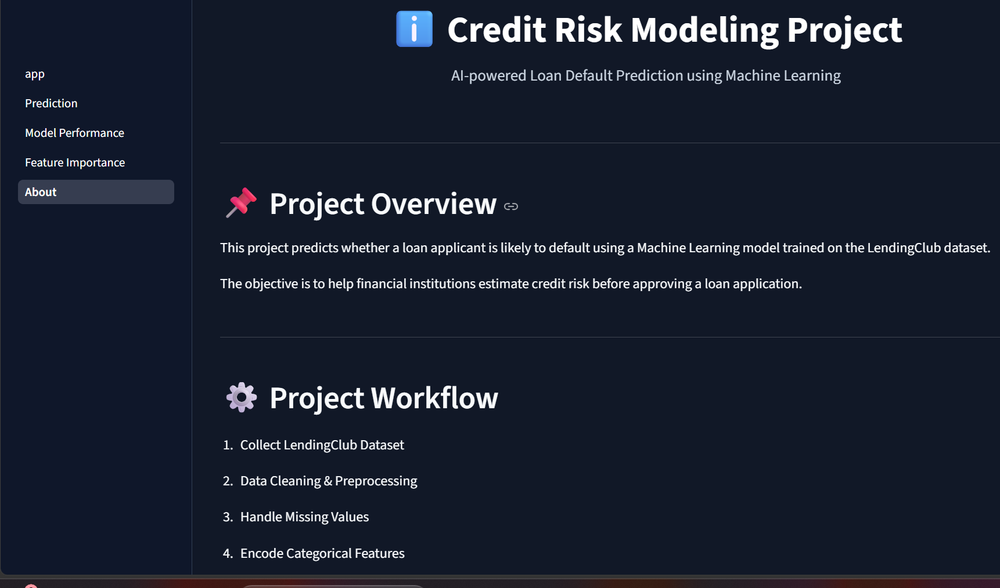

# 🏦 Credit Risk Prediction Dashboard

<p align="center">


</p>

An end-to-end **Machine Learning Credit Risk Prediction Dashboard** built with **Python**, **Scikit-Learn**, **SHAP**, and **Streamlit**.

The application predicts the probability of loan default, estimates loan approval likelihood, explains predictions using SHAP, and visualizes model performance through an interactive dashboard.

---

# 🌐 Live Demo

👉 https://credit-risk-modeling-zjcg9jpcnu2dcddb8ims3c.streamlit.app/

---

# 📸 Project Screenshots

## 🏠 Home



---

## 🏦 Loan Prediction



---

## 📈 Model Performance



---

## 🔍 Feature Importance



---

## ℹ️ About



---

# 🚀 Features

- Predict loan default probability
- Loan approval probability estimation
- Credit score and credit grade generation
- Random Forest based prediction
- SHAP Explainability
- Interactive Plotly charts
- Model Performance Dashboard
- Feature Importance Visualization
- Streamlit Interactive UI
- Responsive Dark Theme

---

# 🧠 Machine Learning Pipeline

```
Loan Dataset
      │
      ▼
Data Cleaning
      │
      ▼
Missing Value Handling
      │
      ▼
Feature Engineering
      │
      ▼
Preprocessing
      │
      ▼
SMOTE
      │
      ▼
Random Forest
      │
      ▼
Prediction
      │
      ▼
SHAP Explainability
```

---

# 📂 Project Structure

```
Credit-Risk-Modeling/

│
├── app.py
├── requirements.txt
├── README.md
│
├── assets/
│   └── style.css
│
├── pages/
│   ├── 1_Prediction.py
│   ├── 2_Model_Performance.py
│   ├── 3_Feature_Importance.py
│   └── 4_About.py
│
├── models/
│   ├── best_model.pkl
│   └── preprocessor.pkl
│
├── notebook/
│   ├── 01_Data_Understanding.ipynb
│   ├── 02_EDA.ipynb
│   ├── 03_Preprocessing.ipynb
│   ├── 04_Model_Training.ipynb
│   ├── 05_Model_Evaluation.ipynb
│   └── 06_SHAP_Analysis.ipynb
│
├── data/
│
├── results/
│
└── screenshots/
```

---

# 📊 Dataset

Dataset used:

**LendingClub Loan Dataset**

The dataset contains borrower financial information including:

- Annual Income
- Loan Amount
- Interest Rate
- Debt-to-Income Ratio
- Credit Grade
- Employment Length
- Home Ownership
- Verification Status
- Revolving Balance
- Public Records
- Delinquencies
- Loan Purpose

---

# 🤖 Machine Learning Model

Algorithm Used

- Random Forest Classifier

Preprocessing

- Missing Value Imputation
- One-Hot Encoding
- Feature Engineering

Handling Imbalanced Data

- SMOTE (Synthetic Minority Oversampling Technique)

Explainability

- SHAP (SHapley Additive exPlanations)

---

# 📈 Model Evaluation

Evaluation Metrics

- Accuracy
- Precision
- Recall
- F1 Score
- ROC-AUC Score

The dashboard provides a dedicated page to visualize model performance and compare evaluation metrics.

---

# 🔍 Explainable AI (SHAP)

The project integrates SHAP to improve transparency of model predictions.

SHAP helps explain:

- Why a prediction was made
- Which features increased default risk
- Which features reduced default risk
- Global feature importance
- Local prediction explanation

---

# 💻 Technologies Used

| Technology | Purpose |
|------------|----------|
| Python | Programming Language |
| Streamlit | Web Application |
| Pandas | Data Processing |
| NumPy | Numerical Computing |
| Scikit-Learn | Machine Learning |
| Imbalanced-Learn | SMOTE |
| SHAP | Explainable AI |
| Plotly | Interactive Visualization |
| Matplotlib | Charts |
| Joblib | Model Serialization |

---

# ⚙️ Installation

Clone the repository

```bash
git clone https://github.com/AnkitMaurya0/Credit-Risk-Modeling.git
```

Move to project directory

```bash
cd Credit-Risk-Modeling
```

Install dependencies

```bash
pip install -r requirements.txt
```

Run the application

```bash
streamlit run app.py
```

---

# 🎯 Future Improvements

- XGBoost Implementation
- LightGBM Model
- PDF Report Download
- Database Integration
- Authentication System
- Cloud API Integration
- Real Credit Bureau Score Integration

---

# ⚠️ Disclaimer

This project is developed for educational, research, and demonstration purposes.

Predictions generated by this application should not be considered as final lending decisions. Final loan approval depends on lender policies, document verification, and regulatory guidelines.

---

# 👨‍💻 Author

**Ankit Maurya**

B.Tech – Artificial Intelligence & Machine Learning

GitHub: https://github.com/AnkitMaurya0

LinkedIn: *(Add your LinkedIn profile here)*

---

## ⭐ Support

If you found this project helpful, please consider giving it a ⭐ on GitHub.
